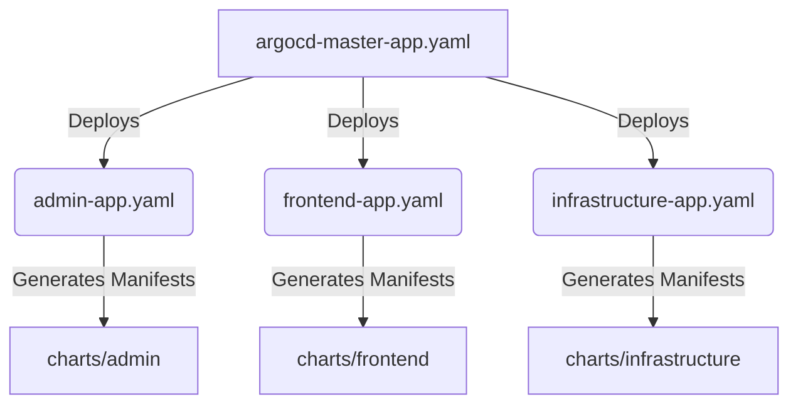

# 🚀 GatherGenie Infrastructure Presentation Guide
*Your script and notes for presenting the GitOps App-of-Apps Architecture.*

---

## 1. Introduction: What Did We Build?
**The Headline:** We successfully modernized the GatherGenie infrastructure by moving from a legacy "Umbrella" Helm Chart to a highly scalable, GitOps-driven **"App of Apps" architecture** managed by ArgoCD.

**Key Benefits to highlight:**
- 🛡️ **Isolation**: If one service fails to deploy, it no longer breaks the entire cluster.
- ⚡ **Speed**: Developers can update and sync individual services without reloading the whole infrastructure.
- 👁️ **Visibility**: Every single microservice gets its own UI card and health metrics in the ArgoCD dashboard.

---

## 2. The "Before" State: The Umbrella Chart Monolith
Explain how the infrastructure used to work.

- **How it worked:** We had one giant folder called `GatherGenie-Chart`. Inside it, we had a `charts/` folder containing all 14 microservices (users, booking, frontend, mongodb, etc.). We also had one massive `values.yaml` file at the root that controlled everything.
- **The Problem:** It was a **Monolith**. In Helm terminology, this is called an *Umbrella Chart*. 
  - If a developer made a syntax error in the `users` chart, the entire `GatherGenie` deployment would crash. 
  - We couldn't easily rollback just *one* service.
  - ArgoCD saw the entire project as a single, bloated application.

---

## 3. The "After" State: ArgoCD App of Apps
Explain the new architecture. 

**The Concept:** Instead of one massive Helm chart ruling them all, we tell ArgoCD to deploy a "Master Application". This Master Application doesn't deploy pods; its only job is to deploy *other* Applications.

**How it works structurally:**
1. **The Tree Root:** `argocd-master-app.yaml` points to the `argocd-apps/` folder in Git.
2. **The Branches:** Inside that folder, we have 14 individual YAML files (e.g., `admin-app.yaml`, `frontend-app.yaml`). Each of these files defines an independent ArgoCD Application.
3. **The Leaves:** Each Application points directly to its own, isolated Helm chart (e.g., `charts/frontend/`).

---

## 4. The Technical Migration: Challenges We Solved
When presenting to a technical audience, it's great to highlight the engineering hurdles we conquered to make this happen.

> [!CAUTION]
> **The Decoupling Challenge**
> When we split the Umbrella chart, the children charts immediately broke and returned `nil pointer evaluating interface` errors. Why? Because the children relied on the "Parent" (the root `values.yaml`) to inject configurations like image repositories and ports.

**How we fixed it:**
- **Standalone `values.yaml`**: We systematically went through `postgres`, `mongodb`, `frontend`, etc., and gave them their own self-sufficient `values.yaml` files.
- **Root Cleanup**: We stripped the root `values.yaml` down to *only* contain `global:` variables (like domain names and default resource limits) that truly apply universally.
- **Robust Templates**: We updated Helm templates (like `deployment.yaml`) so they no longer crashed if a specific nested value was missing during a split deployment.

> [!TIP]
> **The API Gateway Routing Challenge**
> Our `infrastructure` chart defines the network routes (`httproutes.yaml`) via the Kubernetes Gateway API. Because the charts were now independently deployed side-by-side, `.Release.Name` changed! A route looking for `gathergenie-frontend` suddenly couldn't find the sub-chart because the release name changed from the global project to the specific app!
> **The Fix**: We statically bound the Gateway backend references to the correct, newly isolated Kubernetes Service names and hardcoded the cross-chart ports into the infrastructure `values.yaml`.

---

## 5. Summary & Handover
**Conclusion:**
By implementing the App of Apps pattern, GatherGenie is now running a true, production-grade GitOps pipeline. 
- **Everything is declarative** (stored in Git).
- **ArgoCD watches Git** and auto-syncs exactly what is merged.
- **Total Decoupling**: Frontend engineers can push to the frontend chart, and ArgoCD safely syncs *only* the frontend without touching databases or infrastructure routing.

**Demonstration (If you are doing a live demo):**
1. Show the GitHub repository (`argocd-apps/` folder).
2. Show the ArgoCD UI with the beautiful tiles representing every independent service showing `Synced` and `Healthy`.
3. Highlight the `gathergenie-master` app, showing how it spawned all the others.
